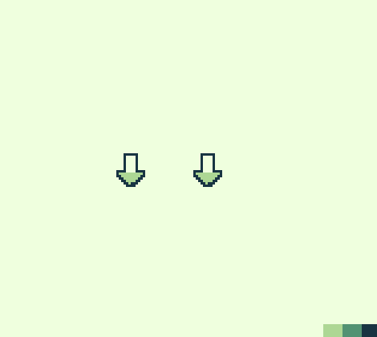

# GBStudio Plugins
I had a couple plugins I made for multi-step events that I found myself repeating too often. Most of these are for different single or multi-actor animations and social events. There are several other plugin repos folks have made, and I used them as a reference for laying out my own plugins. The links to all those resources are [here](#Resources)

## Usage and Installation
Make a plugins folder at the same directory level as your assets folder if you don't already have one. Copy the specific plugin folder you want from this repository's plugins folder to your plugins folder. 

## Plugin List

### Actor Hop
Make your actor do a little hop, or several hops with a set pause between them. Shows up as Actor > Actor Hop. You select an actor, provide the number of hops, and the pause interval. (6 frames is the default, which is roughly 0.1 seconds)

### Social Hop
Do sequential number sets of hops between two actors.

### Dialogue Tree Builder
I built too many dialogue trees, so I made a combo of my standard switches for the sake of saving myself some pain in the visual editor

### Calendar Updater
Basically, you want to have a calendar in your game? Do you want to visually track what day it is? Add this plugin, make a scene with the calendar background and a scene with calendar tiles. Add the Calendar Updater event to the scene with the calendar background, and set the variables as listed. (First one is the variable you use for tracking the day, the rest should be unique variables. I recomment Local 0-4)

### Actor Dialogue Cycler
Do you want your actor to iterate through a set of dialogue options every time you interact with em? That's what this is. There are two checkboxes. One sets the code so it will randomly pick from the list of options each time it's triggered. The second checkbox currently does nothing, but is intended to shuffle the list of options each time you've full cycled through the list. Can have up to 16 dialogue options, as limited by the switch case. It should be fairly easy to add more by using the final else in the switch case, but I don't want to. Should work with avatars and multiple text boxes.

## Non Functional Stuff
These plugins don't currently work right or just don't work. List for my own sanity.

### Sprite Selector
Some cursed nonsense needs figure if this will even work. Currently does not

### JSON Loader
Currently not working, wanted a way to handle big dialogue trees not in the graphical menu that makes me want to cry.

### Tile Animator
Might work, idk, was a predecessor to the Calendar Updater plugin

## Resources
All the other plugin repos and guides for GB Studio that I know of.

- [Your Username's Plugins](https://github.com/Y0UR-U5ERNAME/gbs-plugin-collection)
- [HerrLeise's Plugins and Guide](https://github.com/HerrLeise/GB-Studio-Plugins)
- [Pau Tomas' Plugins](https://github.com/pau-tomas/gb-studio-plugins)
- [Pau Tomas' Guide](https://gist.github.com/pau-tomas/25ef9ab2508b80b22bde4091b1df0503)
- [Doc Hardware's Plugins](https://github.com/dochardware/GBStudio-Plugins)